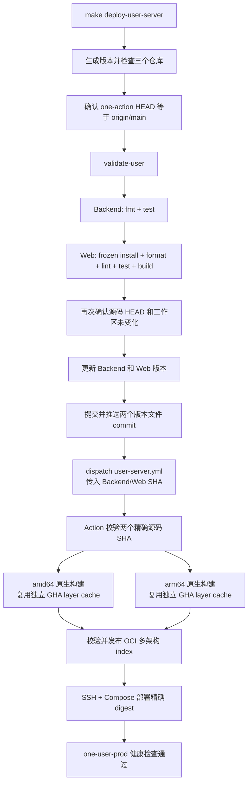

# One Action

One Action 是 One 平台唯一的公共仓库，也是所有产品统一的分发与部署中心。One User、
AMZ、Browser、Node、Notify、Pay、Object 等产品源码仓库均保持私有；私有仓库不自行发布
Release、镜像、安装器或生产部署，也不把私有源码复制到本仓库。

One Action 集中维护 GitHub Actions workflow、发布脚本、公开安装器和产物合同。格式、
lint、测试和必要的本地编译门禁在 `make deploy-*` 触发远端工作流之前完成；Action 使用
受保护凭据读取精确的私有源码 commit/tag，再统一构建、分发，并按产品合同部署。公共日志
和产物不得包含私有源码、Token、环境文件或生产凭据。

公开安装器按产品命名空间组织：One Node 使用 `node/{install,upgrade,uninstall}.sh`
及 `node/scripts/`，One Browser Egress 使用 `egress/{install,uninstall}.sh` 及
`egress/scripts/`。根目录 Egress 入口仅兼容历史命令；新生成的安装命令必须使用
`egress/` 路径。

所有产品最终都必须接入 One Action。当前本地发布入口如下；其他产品在这里
补齐发布合同前，不应视为已经具备正式分发或部署能力：

| 本地入口 | Action 触发方式 | 发布结果 |
|---|---|---|
| `make deploy-object-server` | dispatch `object-server.yml` | 发布 One Object Server 镜像并部署，包含 Web |
| `make deploy-object-web` | dispatch `object-web.yml` | 仅部署 One Object Web 静态文件 |
| `make deploy-user-web` | dispatch `user-web.yml` | 仅部署 Web 静态文件，不重启 Server |
| `make deploy-user-server` | dispatch `user-server.yml` | `ghcr.io/voiceofhu/one-user:<version>`，随后部署该精确 OCI digest |
| `make deploy-node-server` | dispatch `node-server.yml` | `ghcr.io/voiceofhu/node-server:<version>`，随后部署该精确 OCI digest |
| `make deploy-node-web` | dispatch `node-web.yml` | 仅部署 One Node Web 静态文件 |
| `make deploy-node` | dispatch `node-runtime.yml` | `ghcr.io/voiceofhu/one-node:<version>`、双架构二进制、`SHA256SUMS` 和公开 One Action Release |
| `make deploy-browser-app` | dispatch `browser-app.yml` | Linux、Windows、macOS arm64/x64 安装包、`SHA256SUMS` 和公开 One Action Release |
| `make deploy-browser-server` | dispatch `browser-server.yml` | `ghcr.io/voiceofhu/one-browser-backend:<version>` 双架构镜像及 SSH/Compose 部署 |
| `make deploy-browser-web` | dispatch `browser-web.yml` | 独立构建 Web，切换服务器静态文件版本，不更新 Server 容器 |
| `make deploy-browser-egress` | dispatch `browser-egress.yml` | Egress 双架构原生包、`SHA256SUMS`、公开 Release 和 `ghcr.io/voiceofhu/one-browser-egress:<version>` |

`deploy-user-server` 和 `deploy-node-server` 都在镜像发布后执行 SSH/Compose 服务器部署；
`deploy-node` 只触发 Runtime 编译上传。Browser App/Egress 发布产物；Browser Server/Web 使用 SSH 部署。

## Workflow 命名规则

所有工作流直接放在 `.github/workflows/`，使用小写 kebab-case 和 `.yml` 后缀：

- 产品入口：`<product>-<component>[-<purpose>].yml`。产品省略统一的 `one-` 前缀；
  组件使用 `server`、`web`、`app`、`runtime`、`egress`。例如 `user-server.yml`、
  `browser-app.yml`、`node-runtime.yml`；同一组件存在不同用途时才增加后缀。
- 共用工作流：`reusable-<action>-<target>.yml`，通过 `workflow_call` 调用。
  当前 `reusable-publish-server-image.yml` 负责构建 Web 和 Server 多架构镜像。
- Actions 展示名称使用 `One <Product> <Component> [Purpose]`；共用流程使用
  `Reusable <Action> <Target>`，与文件名对应。

`browser-server.yml` 发布并部署 Server；`browser-server-publish.yml` 保留原先仅发布
镜像的入口，要求 `environment=prod`、`publish=true`、`deploy=false`，两者不能互换。

新增工作流时按同产品已有文件创建，更新对应 `scripts/release/` 入口、
`scripts/github/dispatch-workflow.sh` 的固定输入/源码白名单，以及对应产品的测试和
`scripts/validate.sh` 定向检查范围。`make validate` 和 `make check-token` 自动发现全部
`.yml` 工作流；全量校验同时检查命名与本地 reusable 引用。新增产品入口也需补充上方表格。

重命名时同步更新 dispatch 路径、`uses` 引用、脚本、测试和文档。文件名与发布合同分开：
`confirmation`、`workflow_name`、镜像名、Release tag 和 concurrency 标识不能随文件名
机械改写。新文件名须先进入目标 Action 分支，远端才能接收对应 dispatch。

## 发布边界

每次真实发布按固定顺序执行：

1. 确认 `one-action` 和源码仓库位于干净分支，origin 指向固定仓库；
2. 确认本地 `one-action/main` 与 `origin/main` 完全一致；
3. 本地仅运行对应产品的格式、lint、测试和构建；
4. One User 推送版本文件提交；One Node Server、One Node Runtime 和 Browser 三条链路要求本地 HEAD 已与远端分支完全一致；这些链路不创建源码发布 tag；
5. 本地入口把精确 Action SHA、源码 SHA 和版本 dispatch 给对应 workflow（Browser App 直接发送 ref，由 workflow 解析源码 SHA）；One Node Release workflow 仅为公开 Release 自动创建所需的 Action tag；
6. Action 只拉取固定源码、并行编译 amd64/arm64，并上传镜像或 Release 产物；
7. One User 与 One Node Server 在镜像成功合并后，将 digest-qualified 镜像分别部署到受保护的生产 environment。

本地 Git 凭据用于源码 `fetch/push` 和 workflow dispatch；dispatch 依次复用显式 `GH_TOKEN`、`gh auth` 登录或 Git HTTPS credential helper，凭据只进入最终 dispatch 子进程，不进入格式、测试或构建命令。仓库 Secret 只在 workflow 启动后读取私有源码和发布产物。所有发布 workflow 都校验固定的 Action commit 和源码 commit，不读取可变的远端分支头。

## One User 发布流程



`validate-user` 只检查 One User 发布脚本、`user-server.yml` 和共享镜像发布合同，不运行
One Node/Node Server 合同、临时 tag 模拟发布或 One Node 安装生命周期 fixture。
本地 `cargo test` 已编译 Backend 的库和二进制测试目标；release 二进制只在最终 Docker
镜像中构建，避免触发前后重复执行 `cargo check` 和 `cargo build --release`。

## 使用

默认版本按上海时区生成三段数字，也可显式指定：

```bash
make deploy-user-server VERSION=26.821.1200
make deploy-node-server VERSION=26.821.1200
make deploy-node VERSION=26.821.1200
make deploy-browser-app
make deploy-browser-server
make deploy-browser-egress
```

One User、One Node 和 Browser Egress 目标执行各自产品的本地检查；Browser App 在 dispatch 前安装锁定依赖、检查 Node 脚本语法，并运行 Rust fmt、Clippy 和测试；失败即停止，成功后将本地校验过的源码 SHA 交给工作流构建。App 工作区须干净，HEAD 须匹配配置的源码 ref。App 默认使用与其他部署入口相同的上海时间版本（YY.MMDD.HHmm，去除各段前导零），也可通过 `VERSION=...` 显式指定；不再复用源码 package.json 的旧版本。CI 在各平台打包前调用 App 的 `scripts/update-version.mjs`，同步写入 package.json、Tauri 配置、Cargo.toml 和 Cargo.lock，版本修改仅发生在 CI 检出目录。构建前先检查同名 Release，已存在或无法确认时停止，发布阶段仍保留不可覆盖保护。同一分钟内重复发布时需等下一分钟或指定未使用的版本。 与 One Node 一样，App 发布时在 one-action 公共仓库显式创建 `one-browser-app-v<版本>` tag，绑定本次 Action SHA；已有 tag 必须指向相同提交，禁止移动或覆盖。创建 Release 使用 `--verify-tag --latest=false`，源码 SHA 记录在发布说明中，源码仓库不打发布 tag。Browser Server/Web 在本地校验后 dispatch。`deploy-browser-app` 从本地 Git 读取 Action SHA 作为校验参数，向 `ACTION_REF` 分支或标签（默认 `main`）直接发送 dispatch POST，不查询 Action 或私有源码 commit；`browser-app.yml` 使用仓库 Secret 解析源码 ref，所有平台统一检出该 SHA。生产页面地址由 App 的 `src-tauri/tauri.conf.json` 管理（`https://browser.aicbe.com`），无需设置 Action 后端地址变量。修改 workflow 后须先将其推送到目标 Action 分支，新入口才能使用。源码仓库不创建发布 tag；One Node Server 不修改 Web 版本，One Node Runtime 和 Browser 也不修改源码版本。只查看计划时显式启用 dry-run；dry-run 不运行
产品检查、不修改文件、不创建标签，也不访问 GitHub API：

```bash
make deploy-user-server DRY_RUN=true
make deploy-node-server DRY_RUN=true
make deploy-node DRY_RUN=true
make deploy-browser-app DRY_RUN=true
make deploy-browser-server DRY_RUN=true
make deploy-browser-egress DRY_RUN=true
```

版本必须是无 `v` 前缀、无前导零的 `<major>.<minor>.<patch>`。

## 本地门禁

基础检查：

```bash
make validate
make validate-user
make validate-node
make validate-node-server
make validate-browser-egress
make node-check
make node-bundle-installers
```

`make validate` 检查全部活跃 shell、workflow YAML 和发布契约，并运行 One Node 生命周期 fixture。
`make validate-user` 只检查 One User 与共享镜像发布契约；`deploy-user-server` 使用这一范围，
不运行其他产品的模拟发布和生命周期 fixture。
`make validate-node` 只检查 One Node Runtime 的安装生命周期、dispatch、构建和 Release 合同；
`deploy-node` 使用这一范围，并在 Node 源码仓库独立运行 `verify-upgrade`。
`make validate-node-server` 只检查 One Node Server 的发布、镜像与部署契约；
`deploy-node-server` 使用这一范围，不运行 One User 模拟发布或 One Node Runtime 生命周期 fixture。
真实 `deploy-*` 还会执行产品门禁：

- One User：Backend fmt/test；Web frozen install、format、lint、test、build；
- One Node Server：Web frozen install/lint；Backend model/test、vet、release build，
  release build 通过 Server 的 `build: frontend` 唯一执行一次 Web typecheck/Vite build 并暂存 `web-dist`；
- One Node Runtime：仅在 Node 源码仓库执行完整 `verify-upgrade`。
- One Browser Egress：`cargo fmt`、Clippy（warnings 视为错误）和完整 feature 测试。

Browser App/App Server 入口按当前约定不运行本地 fmt、lint、test 或 build；dispatcher 校验
固定远程仓库名，把配置的 ref 解析为精确 SHA，并绑定当前 Action SHA 后直接 dispatch。
Browser Egress 则要求本地源码仓库干净、当前分支与远端完全一致且 Rust 门禁通过，再 dispatch
精确源码 SHA。

任何本地门禁失败都会发生在版本提交或远程 dispatch 之前。

## Action 结构与时间上限

- One User / One Node Server：2 分钟源码解析；amd64 和 arm64 原生 runner 并行构建，
  每个最多 20 分钟；OCI index 合并最多 3 分钟。
- One User / One Node Server 部署：镜像发布成功后运行，各自最多 20 分钟，同一产品同一时间只允许一个生产部署。
- One Node Runtime：2 分钟源码解析；两个架构并行编译和推送，每个最多 15 分钟；
  OCI index、checksum 和公开 One Action GitHub Release 上传最多 8 分钟。
- One Browser App：2 分钟源码解析；Linux、Windows、macOS arm64/x64 并行打包；
- One Browser App Server：复用 Web+Backend 双架构镜像发布器；
- One Browser App Egress：amd64/arm64 原生包和镜像并行构建，再分别发布 Release 与 OCI index。

Action 中没有 fmt、lint、test、race、e2e 或 installer lifecycle；双架构 Docker 构建使用
按产品和架构隔离的 GHA layer cache。One User 与 One Node Server 保留各自隔离的
SSH/Compose 部署步骤。
不同版本可并行；相同产品、相同版本的重复触发由 concurrency group 串行保护。

## GitHub 配置

`one-action` 仓库需要配置 Repository Secret `GH_TOKEN`，用于：

- 读取固定的私有源码仓库；
- 向 `ghcr.io/voiceofhu/*` 推送架构镜像和 OCI index；
- 在 `voiceofhu/one-action@one-node-v<version>` 创建并上传公开 One Node Release。
- 在 One Action 创建 One Browser App 与 Egress 的产品前缀 Release。

App workflow 还需要 Repository Variable `ONE_BROWSER_BACKEND_URL`，值为生产 Backend 的
HTTPS origin；该值在 Tauri 打包时写入远程能力和登录来源白名单。

One Node 的构建使用 `contents: read`；Release job 使用仓库 `GITHUB_TOKEN` 的 `contents: write`。

One User 和 One Node Server 分别使用受保护的 `one-user-prod`、`one-node-prod` environment，并需要：

- Secrets：`DEPLOY_HOST`、`DEPLOY_PORT`（可选，默认 `22`）、`DEPLOY_USER`、
  `DEPLOY_SSH_KEY`、`DEPLOY_KNOWN_HOSTS`；
- Variables：`DEPLOY_REMOTE_DIR`、`DEPLOY_URL`。One User 默认 `/opt/one-user` 与
  `https://oa.aicbe.com`；One Node Server 默认 `/opt/one-node` 与
  `https://marseo.eu.org`。

部署 job 使用 `GH_TOKEN` 让服务器临时登录 GHCR，部署后始终尝试退出 Registry；服务器
Compose 文件来自同一 Backend/Server 源码 commit；One User 检查 `/readyz` 和首页，
One Node Server 检查 `/api/healthz` 和首页。

## One Node 生命周期入口

稳定入口位于：

```text
node/install.sh
node/upgrade.sh
node/uninstall.sh
```

安装器未指定 `ONE_NODE_VERSION` 时会选择 `one-action` 仓库最新的 `one-node-v<version>` Release；显式设置版本
可固定安装或回滚。完整参数和生命周期约束见 [node/README.md](node/README.md)。

安装成功后会保留 `/opt/one-node/install.sh`。在节点服务器执行
`sudo /opt/one-node/install.sh` 可进入交互菜单；也可使用 `--status`、
`--doctor`、`--upgrade`、`--rollback`、`--restart`、`--logs` 和
`--uninstall --yes` 直接管理 Native 或 Docker 节点。状态输出包含运行模式、版本、
PID、内存、运行时长和服务/容器状态。

## 目录

```text
.github/workflows/   六个产品入口和一个 Web+Backend 复用发布工作流
node/                One Node 安装、升级、卸载和本地 fixture
scripts/release/     本地发布入口与上传辅助脚本
scripts/deploy/      One User / One Node Server SSH、Registry 和 Compose 部署脚本
scripts/github/      GitHub 只读检查和历史调度辅助代码
tests/               当前六条发布链的本地契约测试
make/                Makefile 子模块
```

本地 YAML、shell 和测试通过只能证明提交内容满足当前发布契约；GHCR Package 权限、Runner
可用性、真实远端上传和服务器部署仍需由首次 GitHub Actions 运行证明。

## Browser Server 与 Web 发布

`make deploy-browser-server` 按 One Node Server 的流程校验源码、发布双架构镜像并部署。
每次 Server 部署都会将镜像内配套 Web 切换到 `/opt/one-browser/web/current`；失败时同时回滚 Server 和 Web。
`make deploy-browser-web` 只校验 Web、构建生产静态文件并通过 SSH 发布，失败回滚到上一目录，不构建或重启 Server。
Web 目录通过只读挂载提供给 Server，两个工作流共用部署锁。旧入口 `deploy-app-server` 保留为 Server 入口别名。

先执行一次新版 Server 部署以建立持久化 Web 挂载，再使用独立 Web 发布。
两条链使用 `one-browser-prod` environment，与 One Node Server 一样配置 `DEPLOY_HOST`、`DEPLOY_PORT`、
`DEPLOY_USER`、`DEPLOY_SSH_KEY`、`DEPLOY_KNOWN_HOSTS` secrets，以及源码/镜像凭据 `GH_TOKEN`。
`DEPLOY_REMOTE_DIR` 默认 `/opt/one-browser`，`DEPLOY_URL` 默认 `https://browser.aicbe.com`。
服务器目录应预先存在且包含生产 `.env`；反向代理指向本地 27514 端口。

## One Node Web 独立更新

`make deploy-node-web` 仅安装锁定的 Web 依赖、执行 lint 和生产构建（含 TypeScript 检查），
然后 dispatch `node-web.yml`，上传静态文件并切换 `/opt/one-node/web/current`。
不编译后台、不发布后台镜像、不重启后台容器；健康检查失败时回滚 Web。
首次需先通过新版 `make deploy-node-server` 部署带持久化 Web 挂载的 Compose。
独立更新的 Web 在普通容器重启/重建后仍保留；再次发布 Server 时切换到新镜像配套 Web。
使用现有 `one-node-prod` environment 的 SSH secrets、`DEPLOY_REMOTE_DIR` 和 `DEPLOY_URL`，
默认目录 `/opt/one-node`，默认站点 `https://marseo.eu.org`；与 Server 发布共用部署锁。
`make validate-node-web` 检查此发布链，`make deploy-node-web DRY_RUN=true` 只显示计划。

Browser 与 Node 的 Web 均由后台在 `/` 路由提供，API 路由保持不变。

### Browser Egress 安装后管理

安装或升级后保留 `/opt/one-browser-egress/install.sh`，执行
`sudo /opt/one-browser-egress/install.sh` 打开交互菜单，支持状态、运行环境检查、
升级至最新版或指定版本、重启、日志及卸载。非交互调用使用 `--status`、`--doctor`、
`--upgrade [latest|VERSION]`、`--restart`、`--logs [--follow]`、`--uninstall --yes`。
升级保留已有节点身份，无需重新提供安装令牌。

Server 通过心跳响应下发升级指令，egress 写入受管请求后由 systemd updater 调用同一
管理入口执行指定版本升级，并通过心跳回报结果。主机执行日志位于
`/opt/one-browser-egress/last-upgrade.log`（仅 root 可读）。

Egress updater 会在主机启动和异常退出后恢复遗留任务：安装记录已是目标版本时补报成功，
否则补报中断失败并允许重新发起升级，不自动重复安装。升级执行中的状态按同一任务 ID
读取，避免被旧 pending 请求或上一任务结果遮蔽。已有节点需通过一次安装/升级更新
systemd 单元，才能获得启动恢复能力。

### One User 独立 Web 部署

`make deploy-user-server` 发布 Server 镜像并同步更新配套 Web；`make deploy-user-web`
只检查 Web（format、lint、test、build），按精确源码 SHA 构建并切换 `/opt/one-user/web/current`，不重建或重启 Server。
两条部署链使用同一生产并发锁；Web 健康检查失败时恢复上一版本。
首次使用独立 Web 部署前，先执行一次 `make deploy-user-server`，建立 Web 目录和持久化挂载。
`make validate-user-web` 检查独立发布合同，`make deploy-user-web DRY_RUN=true` 仅显示计划。
Browser 已采用对应的 `make deploy-browser-server` / `make deploy-browser-web`，行为一致。

## One Object Server / Web

`make deploy-object-server` 仿照 One User：检查本地源码，提交并推送版本变更，
以精确 Server/Web SHA dispatch `object-server.yml`，构建 amd64/arm64 镜像，
随后按 OCI digest 部署 `ghcr.io/voiceofhu/one-object`。Server 发布同步激活镜像内的 Web。
`make deploy-object-web` 仅检查并发布 Web，不依赖 Server checkout，不重启 Server。

源码固定为 `voiceofhu/one-object-server` 和 `voiceofhu/one-object-web`，对应本地
`../one-object/backend` 与 `../one-object/web`。源码与 Action 必须已提交并同步远端。
命令默认生成版本，也可传 `VERSION=26.907.1800`；`DRY_RUN=true` 仅检查并显示计划。
本地契约检查：`make validate-object`、`make validate-object-web`。

首次先部署 Server，建立 `/opt/one-object/web` 持久化目录与挂载。
GitHub Environment `one-object-prod` 需要：
- Secrets：`DEPLOY_HOST`、`DEPLOY_USER`、`DEPLOY_SSH_KEY`、`DEPLOY_KNOWN_HOSTS`；
  可选 `DEPLOY_PORT`（默认 22）；`GH_TOKEN` 必须能读取两个私有源仓库并发布 GHCR。
- Variables：可选 `DEPLOY_URL`（默认 https://object.aicbe.com），可选 `DEPLOY_REMOTE_DIR`（默认 `/opt/one-object`）。
- 服务器预置可写部署目录、`.env`、Docker Compose、curl、flock 和外部数据库网络
  （默认 `db-networks`）。服务监听本机 `27525`，公网反向代理需指向该端口。
- `.env` 配置专用数据库 `DB_URL`、OIDC 参数及 `STORAGE_ENCRYPTION_KEY`；
  数据库须事先完成初始化/升级。部署不会自动运行 SQL，也不需要 One User 的 cert 目录。

Server 与 Web 共享部署锁，保留旧静态资源，健康检查失败时回滚。
