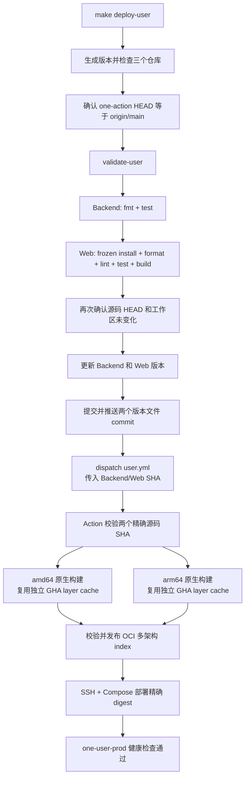

# One Action

One Action 是 One 平台唯一的公共仓库，也是所有产品统一的分发与部署中心。One User、
AMZ、Browser、Node、Notify、Pay、Object 等产品源码仓库均保持私有；私有仓库不自行发布
Release、镜像、安装器或生产部署，也不把私有源码复制到本仓库。

One Action 集中维护 GitHub Actions workflow、发布脚本、公开安装器和产物合同。格式、
lint、测试和必要的本地编译门禁在 `make deploy-*` 触发远端工作流之前完成；Action 使用
受保护凭据读取精确的私有源码 commit/tag，再统一构建、分发，并按产品合同部署。公共日志
和产物不得包含私有源码、Token、环境文件或生产凭据。

所有产品最终都必须接入 One Action。当前已实现并保留三条活跃发布链；其他产品在这里
补齐发布合同前，不应视为已经具备正式分发或部署能力：

| 本地入口 | Action 触发方式 | 发布结果 |
|---|---|---|
| `make deploy-user` | dispatch `user.yml` | `ghcr.io/voiceofhu/one-user:<version>`，随后部署该精确 OCI digest |
| `make deploy-node-server` | dispatch `node-server.yml` | `ghcr.io/voiceofhu/node-server:<version>`，随后部署该精确 OCI digest |
| `make deploy-node` | dispatch `node.yml` | `ghcr.io/voiceofhu/one-node:<version>`、双架构二进制、`SHA256SUMS` 和公开 One Action Release |

`deploy-user` 和 `deploy-node-server` 都在镜像发布后执行 SSH/Compose 服务器部署；
`deploy-node` 只触发 Runtime 编译上传。Browser、AMZ、Egress 和 App 的旧工作流不在活跃发布清单中。

## 发布边界

每次真实发布按固定顺序执行：

1. 确认 `one-action` 和源码仓库位于干净分支，origin 指向固定仓库；
2. 确认本地 `one-action/main` 与 `origin/main` 完全一致；
3. 本地仅运行对应产品的格式、lint、测试和构建；
4. One User 推送版本文件提交；One Node Server 和 One Node Runtime 要求本地 HEAD 已与远端分支完全一致；三条链路都不创建源码发布 tag；
5. 本地入口把精确 Action SHA、源码 SHA 和版本 dispatch 给对应 workflow；One Node Release workflow 仅为公开 Release 自动创建所需的 Action tag；
6. Action 只拉取固定源码、并行编译 amd64/arm64，并上传镜像或 Release 产物；
7. One User 与 One Node Server 在镜像成功合并后，将 digest-qualified 镜像分别部署到受保护的生产 environment。

本地 Git 凭据用于源码 `fetch/push`，本机 `GH_TOKEN` 只注入最终 dispatch 子进程，不进入格式、测试或构建命令。三个 workflow 都校验固定的 Action commit 和源码 commit，不读取可变的远端分支头。

## One User 发布流程



`validate-user` 只检查 One User 发布脚本、`user.yml` 和共享镜像发布合同，不运行
One Node/Node Server 合同、临时 tag 模拟发布或 One Node 安装生命周期 fixture。
本地 `cargo test` 已编译 Backend 的库和二进制测试目标；release 二进制只在最终 Docker
镜像中构建，避免触发前后重复执行 `cargo check` 和 `cargo build --release`。

## 使用

默认版本按上海时区生成三段数字，也可显式指定：

```bash
make deploy-user VERSION=26.821.1200
make deploy-node-server VERSION=26.821.1200
make deploy-node VERSION=26.821.1200
```

三个目标默认执行各自产品的真实本地检查，并通过 workflow dispatch 触发对应 Action。源码仓库不创建发布 tag；One Node Server 不修改 Web 版本，One Node Runtime 也不修改源码 `VERSION`。只查看计划时显式启用 dry-run；dry-run 不运行
产品检查、不修改文件、不创建标签，也不访问 GitHub API：

```bash
make deploy-user DRY_RUN=true
make deploy-node-server DRY_RUN=true
make deploy-node DRY_RUN=true
```

版本必须是无 `v` 前缀、无前导零的 `<major>.<minor>.<patch>`。

## 本地门禁

基础检查：

```bash
make validate
make validate-user
make validate-node
make validate-node-server
make node-check
make node-bundle-installers
```

`make validate` 检查全部活跃 shell、workflow YAML 和发布契约，并运行 One Node 生命周期 fixture。
`make validate-user` 只检查 One User 与共享镜像发布契约；`deploy-user` 使用这一范围，
不运行其他产品的模拟发布和生命周期 fixture。
`make validate-node` 只检查 One Node Runtime 的 dispatch、构建和 Release 合同；
`deploy-node` 使用这一范围，并在 Node 源码仓库独立运行 `verify-upgrade`。
`make validate-node-server` 只检查 One Node Server 的发布、镜像与部署契约；
`deploy-node-server` 使用这一范围，不运行 One User 模拟发布或 One Node Runtime 生命周期 fixture。
真实 `deploy-*` 还会执行产品门禁：

- One User：Backend fmt/test；Web frozen install、format、lint、test、build；
- One Node Server：Web frozen install/lint；Backend model/test、vet、release build，
  release build 通过 Server 的 `build: frontend` 唯一执行一次 Web typecheck/Vite build 并暂存 `web-dist`；
- One Node Runtime：仅在 Node 源码仓库执行完整 `verify-upgrade`。

任何本地门禁失败都会发生在版本提交或远程 dispatch 之前。

## Action 结构与时间上限

- One User / One Node Server：2 分钟源码解析；amd64 和 arm64 原生 runner 并行构建，
  每个最多 20 分钟；OCI index 合并最多 3 分钟。
- One User / One Node Server 部署：镜像发布成功后运行，各自最多 20 分钟，同一产品同一时间只允许一个生产部署。
- One Node Runtime：2 分钟源码解析；两个架构并行编译和推送，每个最多 15 分钟；
  OCI index、checksum 和公开 One Action GitHub Release 上传最多 8 分钟。

Action 中没有 fmt、lint、test、race、e2e 或 installer lifecycle；双架构 Docker 构建使用
按产品和架构隔离的 GHA layer cache。One User 与 One Node Server 保留各自隔离的
SSH/Compose 部署步骤。
不同版本可并行；相同产品、相同版本的重复触发由 concurrency group 串行保护。

## GitHub 配置

`one-action` 仓库需要配置 Repository Secret `GH_TOKEN`，用于：

- 读取固定的私有源码仓库；
- 向 `ghcr.io/voiceofhu/*` 推送架构镜像和 OCI index；
- 在 `voiceofhu/one-action@one-node-v<version>` 创建并上传公开 One Node Release。

One Node 的构建使用 `contents: read`；Release job 使用仓库 `GITHUB_TOKEN` 的 `contents: write`。

One User 和 One Node Server 分别使用受保护的 `one-user-prod`、`one-node-prod` environment，并需要：

- Secrets：`DEPLOY_HOST`、`DEPLOY_PORT`（可选，默认 `22`）、`DEPLOY_USER`、
  `DEPLOY_SSH_KEY`、`DEPLOY_KNOWN_HOSTS`；
- Variables：`DEPLOY_REMOTE_DIR`、`DEPLOY_URL`。One User 默认 `/opt/one-user` 与
  `https://oa.aicbe.com`；One Node Server 默认 `/opt/one-node` 与
  `https://marseo.eu.org`。

部署 job 使用 `GH_TOKEN` 让服务器临时登录 GHCR，部署后始终尝试退出 Registry；服务器
Compose 文件来自同一 Backend/Server 源码 commit；One User 检查 `/readyz` 和首页，
One Node Server 检查 `/api/healthz` 和首页。

## One Node 生命周期入口

稳定入口位于：

```text
node/install.sh
node/upgrade.sh
node/uninstall.sh
```

安装器未指定 `ONE_NODE_VERSION` 时会选择 `one-action` 仓库最新的 `one-node-v<version>` Release；显式设置版本
可固定安装或回滚。完整参数和生命周期约束见 [node/README.md](node/README.md)。

## 目录

```text
.github/workflows/   三个产品入口和一个 Web+Backend 复用发布工作流
node/                One Node 安装、升级、卸载和本地 fixture
scripts/release/     本地发布入口与上传辅助脚本
scripts/deploy/      One User / One Node Server SSH、Registry 和 Compose 部署脚本
scripts/github/      GitHub 只读检查和历史调度辅助代码
tests/               当前三条发布链的本地契约测试
make/                Makefile 子模块
```

本地 YAML、shell 和测试通过只能证明提交内容满足当前发布契约；GHCR Package 权限、Runner
可用性、真实远端上传和服务器部署仍需由首次 GitHub Actions 运行证明。
